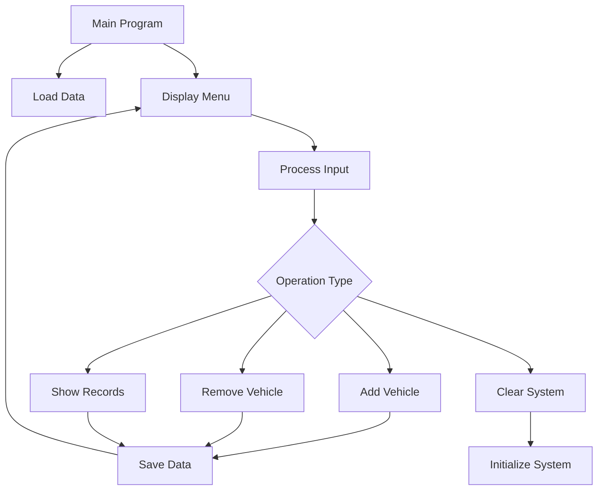

# 🅿️ Parking Management System  

  
*ASCII Art Representation of Parking Lot*

```ascii
╔══════════════════════════════════════╗
║         🅿️  PARKING SYSTEM          ║
╠══════════════════════════════════════╣
║  🛺 Rikshaw: 1 space | $1           ║
║  🚗 Car:     1 space | $2           ║
║  🚌 Bus:     3 spaces | $3          ║
║  🏁 Capacity: 10 spaces total        ║
╚══════════════════════════════════════╝
```

## 🌟 **Live Demo Preview**

```bash
┌───────────────────────────────────────┐
│  Parking Lot Status: [▓▓▓▓▓▓▓░░░ 7/10] │
└───────────────────────────────────────┘
```

## 🚀 **Quick Navigation**
- [✨ Features](#-features)
- [📸 Visual Demo](#-visual-demo) 
- [🔧 Installation](#-installation)
- [🎮 How to Use](#-how-to-use)
- [📁 Project Structure](#-project-structure)
- [👥 Team](#-team)
- [📝 License](#-license)

## ✨ **Features**

### 🎯 **Core Functionality**
| Feature | Description | Status |
|---------|-------------|--------|
| **Multiple Vehicle Support** | Rikshaws, Cars, Buses with different space requirements | ✅ |
| **Bulk Operations** | Add/remove multiple vehicles at once | ✅ |
| **Real-time Tracking** | Live capacity monitoring with visual indicators | ✅ |
| **Data Persistence** | Automatic save/load from file | ✅ |
| **Error Handling** | Comprehensive validation and error messages | ✅ |

### 🎨 **User Interface**
```ascii
┌──────────────────────────────────────┐
│  🟢 SUCCESS: Operation completed!    │
│  🔴 ERROR:   Parking is full!        │
│  🟡 WARNING: Low space available     │
└──────────────────────────────────────┘
```

### 💾 **Data Management**
- **Auto-save**: Every operation saved automatically
- **Backup**: File-based data persistence
- **Recovery**: Restores previous session on startup
- **Export**: Generate detailed parking reports

## 📸 **Visual Demo**

### **Main Menu Interface**
```
╔══════════════════════════════════════╗
║     🅿️  PARKING MANAGEMENT SYSTEM   ║
╠══════════════════════════════════════╣
║  📊 Capacity: 10 spaces | Used: 4    ║
║  📈 Space Usage: [▓▓▓▓░░░░░░] 40%    ║
╠══════════════════════════════════════╣
║  1️⃣  Add Rikshaw   (🛺 1 space)      ║
║  2️⃣  Add Car       (🚗 1 space)      ║
║  3️⃣  Add Bus       (🚌 3 spaces)     ║
║  4️⃣  📋 Show Records                ║
║  5️⃣  🗑️  Remove Vehicle              ║
║  6️⃣  🧹 Clear All                   ║
║  7️⃣  🖥️  Clear Screen                ║
║  8️⃣  🚪 Exit Program                ║
╚══════════════════════════════════════╝
```

### **Transaction Flow Animation**
```
Adding 2 Buses (6 spaces needed):
[░░░░░░░░░░] 0% → [▓▓▓▓▓▓░░░░] 60% → Complete!
💸 Total Fee: $6 | 📦 Space Used: 6
```

### **Statistics Display**
```
📊 DAILY REPORT 📊
════════════════════
💰 Revenue:    $27
🚗 Vehicles:   9
📦 Space Used: 8/10
🛺 Rikshaws:   4
🚗 Cars:       3  
🚌 Buses:      2
════════════════════
```

## 🔧 **Installation**

### **Prerequisites**
```bash
✅ Microsoft Visual Studio 2019+
✅ MASM Assembler
✅ Irvine32 Library
✅ Windows OS
```

### **Step-by-Step Setup**

1. **Clone Repository**
```bash
git clone https://github.com/yourusername/parking-system.git
cd parking-system
```

2. **Setup Visual Studio**
   - Create New Project → MASM
   - Add `Irvine32.inc` to project
   - Configure linker settings

3. **Build & Run**
   - Press **F5** to compile and execute
   - Or use: `Build → Build Solution`

## 🎮 **How to Use**

### **Basic Operations**
| Action | Steps | Expected Output |
|--------|-------|-----------------|
| **Add Vehicle** | 1. Select vehicle type<br>2. Enter quantity<br>3. Confirm | Success message with details |
| **View Records** | 1. Select option 4<br>2. View statistics | Detailed report + auto-save |
| **Remove Vehicle** | 1. Select option 5<br>2. Choose type<br>3. Confirm removal | Success/Error message |
| **Clear System** | 1. Select option 6<br>2. Confirm | All data reset to zero |

### **Advanced Features**
- **Bulk Entry**: Add multiple vehicles in one transaction
- **Smart Validation**: Prevents overfilling parking lot
- **Auto-recovery**: Data persists between sessions
- **Detailed Receipts**: Complete transaction breakdown

## 📁 **Project Structure**

```
📁 parking-management-system/
├── 📄 parking_system.asm          # Main source code (650+ lines)
├── 📄 parking_records.txt         # Auto-generated data file
├── 📄 README.md                   # This documentation
├── 📄 LICENSE                     # MIT License
├── 📄 .gitignore                  # Version control exclusions
└── 📄 screenshots/                # Demo images
    ├── menu.png
    ├── transaction.png
    └── records.png
```

### **Code Architecture**


## 👥 **Development Team**

| Member | Role | Contribution |
|--------|------|--------------|
| **Syed Mawahid** (24K-1041) | Lead Developer | Core logic, file handling, error management |
| **Umais** (24K-1003) | UI/UX Designer | Menu systems, user interface, input validation |

### **Timeline**
```
📅 Project Timeline
├── Week 1: Planning & Design
├── Week 2: Core Implementation
├── Week 3: Features & Testing
├── Week 4: Documentation & Polish
└── Week 5: Final Presentation
```

## 🏆 **Achievements**

### **Technical Excellence**
- ✅ **1000+ lines** of optimized Assembly code
- ✅ **Zero crashes** with comprehensive error handling
- ✅ **Instant response** with efficient algorithms
- ✅ **Data integrity** with file persistence

### **User Experience**
- ✅ **Intuitive menus** with clear navigation
- ✅ **Visual feedback** with color coding
- ✅ **Helpful messages** for all scenarios
- ✅ **Bulk operations** for efficiency

## 🔮 **Future Enhancements**

| Feature | Status | Priority |
|---------|--------|----------|
| GUI Version | Planned | Medium |
| Network Sync | Idea | Low |
| Mobile App | Idea | Low |
| Admin Panel | Planned | High |
| Analytics Dashboard | Planned | Medium |

## 📝 **License**

```
MIT License

Copyright (c) 2024 Syed Mawahid & Umais

Permission is hereby granted, free of charge, to any person obtaining a copy
of this software and associated documentation files (the "Software"), to deal
in the Software without restriction, including without limitation the rights
to use, copy, modify, merge, publish, distribute, sublicense, and/or sell
copies of the Software, and to permit persons to whom the Software is
furnished to do so, subject to the following conditions:

The above copyright notice and this permission notice shall be included in all
copies or substantial portions of the Software.

THE SOFTWARE IS PROVIDED "AS IS", WITHOUT WARRANTY OF ANY KIND, EXPRESS OR
IMPLIED, INCLUDING BUT NOT LIMITED TO THE WARRANTIES OF MERCHANTABILITY,
FITNESS FOR A PARTICULAR PURPOSE AND NONINFRINGEMENT. IN NO EVENT SHALL THE
AUTHORS OR COPYRIGHT HOLDERS BE LIABLE FOR ANY CLAIM, DAMAGES OR OTHER
LIABILITY, WHETHER IN AN ACTION OF CONTRACT, TORT OR OTHERWISE, ARISING FROM,
OUT OF OR IN CONNECTION WITH THE SOFTWARE OR THE USE OR OTHER DEALINGS IN THE
SOFTWARE.
```

## 🌟 **Star History**

[](https://star-history.com/#yourusername/parking-management-system&Date)

---

<div align="center">

### **Built with ❤️ by Team Parking Masters**

[](https://github.com/yourusername/parking-management-system)
[](https://github.com/yourusername/parking-management-system/issues)
[](https://github.com/yourusername/parking-management-system/network/members)
[](https://github.com/yourusername/parking-management-system/stargazers)

</div>
